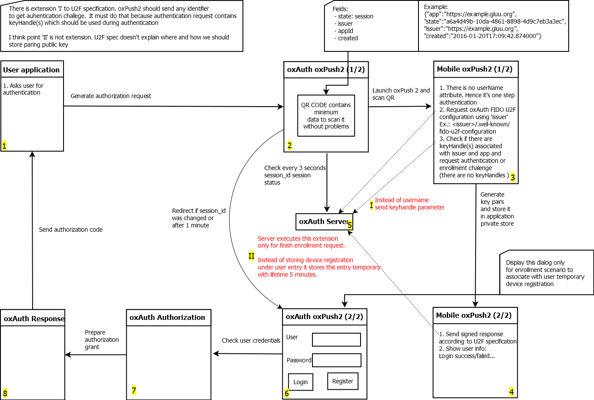
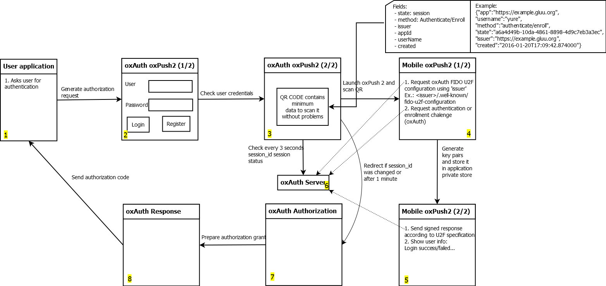

# oxPush2
oxPush2 is a free open source two-factor authentication application that can be used in conjunction with Gluu's free open source central authentication server, called the [Gluu Server](http://gluu.org). During Enrollment oxPush2 uses the FIDO U2F endpoints built into the Gluu Server to enroll a public key. When authentication happens, there is a challenge response to ensure that the device has the respective private key. 

Funding for this project was provided as part of an [NSTIC pilot](http://www.morphotrust.com/NSTICNorthCarolinaPilot.aspx). oxPush2 is also used as the foundation for the commercially available [Super Gluu two-factor mobile authentication application](http://super.gluu.org).

## oxPush2 U2F Workflows

### One Step Workflow

### Two Step Workflow

### IOS version
oxPush authenticator available now for ios devices
